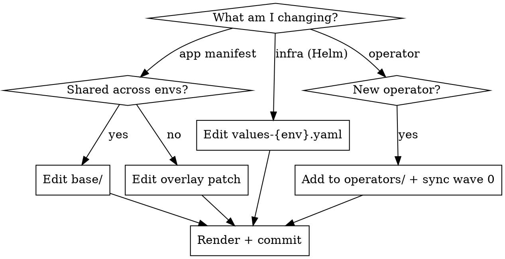

# Deploy Workflow

Guide for modifying Kubernetes deployment manifests in the `deploy/` directory.

## Structure

```
deploy/
├── application/base/          # Shared manifests (deployments, services, network-policies)
├── application/overlays/      # Per-env patches (dev, staging, prod)
├── infrastructure/            # Helm charts (e.g., nats, valkey) + Kustomize (e.g., postgresql, temporal)
├── operators/                 # Cluster-wide operators (argocd, cnpg, vault, cert-manager, etc.)
├── argocd/                    # App-of-apps + ApplicationSets
├── vault/                     # Policies and seed scripts
└── scripts/                   # Bootstrap and utility scripts
```

## Decision Flow



## Key Conventions

| Rule | Detail |
|------|--------|
| `PLACEHOLDER_ENV` | Base SecretProviderClass uses this token; each overlay patches it to the env name |
| Sync waves | operators(0) -> postgres(1) -> infrastructure(2) -> application(3) |
| PDBs | Meaningful only with >= 2 replicas; dev uses 1 replica (PDB is no-op) |
| Rendered output | Always run `./scripts/render-manifests.sh` and commit `rendered-manifests/` |
| Vault paths | `secret/{project}/{env}/{service}` |
| Vault roles | `{project}-{service}-{env}` |
| Image tags | Managed by ArgoCD Image Updater (dev auto, staging/prod manual) |

## Steps for Any Change

1. Edit the appropriate file (base, overlay, or Helm values)
2. Run `kustomize build deploy/application/overlays/{env}` to verify
3. Run `./scripts/render-manifests.sh` to render all overlays
4. Commit the rendered output alongside source changes

## Adding a New Environment Overlay

1. Create `deploy/application/overlays/{env}/kustomization.yaml` referencing base
2. Add patches for HPA, ingress hostname, image tags, `secret-provider-class.yaml`
3. Add env to `argocd/applicationsets/{project}.yaml` generator
4. Create Vault seed script at `vault/seed/seed-{env}.sh`
5. Render and commit

## Common Mistakes

- **Editing rendered-manifests directly** -- always edit source, then render
- **Forgetting PLACEHOLDER_ENV** -- new SecretProviderClass must use the token
- **Wrong sync wave** -- operators must be wave 0, apps must be wave 3
- **Hardcoding image tags** -- Image Updater handles this via sidecar files
