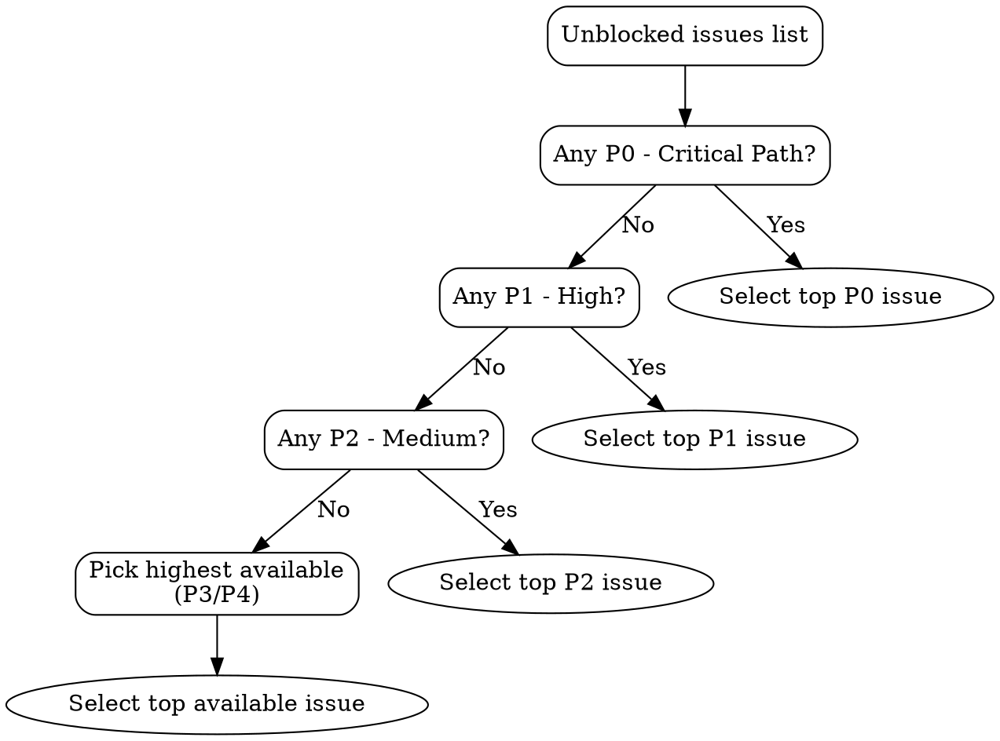

# Find Work

Identify the highest-priority unblocked issue to work on next.

## Step 1: Get Prioritized Unblocked Work

Run the find-unblocked-work script to list all open issues with no open blockers, sorted by priority:

```bash
${CLAUDE_PLUGIN_ROOT}/scripts/find-unblocked-work.sh
```

## Step 2: Apply Priority Decision Flow

Use the following decision flow to select the next issue:



## Priority Reference

| Priority | Meaning | Action |
|----------|---------|--------|
| P0 - Critical Path | Must be done for launch | Work on immediately |
| P1 - High | Important, schedule soon | Work on next if no P0 |
| P2 - Medium | Normal priority | Standard queue |
| P3 - Low | Nice to have | Only if nothing higher |
| P4 - Future | Backlog / someday | Deprioritize |

## Step 3: Verify Blockers for a Candidate

Before committing to an issue, verify its full dependency tree:

```bash
${CLAUDE_PLUGIN_ROOT}/scripts/show-blockers.sh <ISSUE_NUMBER>
```

Check that all blockedBy items are closed. Also check sub-issues -- if the issue has open sub-issues, those may need to be completed first.

## Step 4: Start Work

After selecting an issue:

1. **Set status to In Progress** on the project board (use `gh project item-edit` or the GitHub UI).
2. **Check for a design doc** -- look at the issue body and the Design Doc field on the board. If a design doc exists, read it before starting.
3. **Check for implementation plans** -- look for linked documents or plan files in the repo (`docs/plans/`).
4. **Create a branch** and begin implementation.
